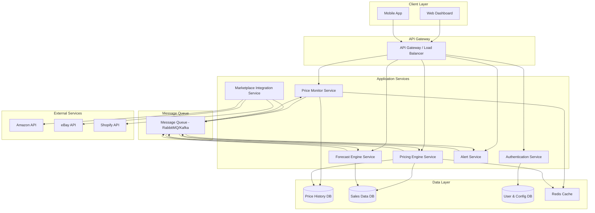

# Design Document: Dukaan AI

## Overview

Dukaan AI is an AI-powered pricing and inventory intelligence platform that helps marketplace sellers optimize their pricing strategies and inventory decisions. The system architecture follows a microservices pattern with distinct components for price monitoring, pricing recommendations, demand forecasting, and analytics.

The platform integrates with multiple marketplace APIs (Amazon, eBay, Shopify) to collect competitor pricing data and automate price updates. Machine learning models power the demand forecasting and pricing optimization engines, while a real-time analytics dashboard provides actionable insights to sellers.

### Key Design Principles

1. **Modularity**: Separate concerns into distinct services (monitoring, pricing, forecasting, analytics)
2. **Real-time Processing**: Use event-driven architecture for immediate alerts and updates
3. **Scalability**: Design for horizontal scaling to support growing user base
4. **Data Integrity**: Ensure consistency across distributed components
5. **Security**: Encrypt sensitive data and implement robust authentication
6. **Testability**: Design components with clear interfaces for property-based testing

## Architecture

### High-Level Architecture



### Service Responsibilities

**Price Monitor Service**
- Poll marketplace APIs for competitor prices
- Detect price changes and calculate deltas
- Store historical price data
- Emit price change events

**Pricing Engine Service**
- Calculate pricing recommendations based on multiple factors
- Apply pricing strategies (competitive, premium, clearance)
- Calculate price elasticity
- Respect profit margin constraints

**Forecast Engine Service**
- Analyze historical sales data
- Generate demand forecasts using time series models
- Detect seasonal patterns
- Calculate forecast confidence intervals

**Alert Service**
- Process events from other services
- Generate alerts based on configured rules
- Deliver notifications via email, SMS, webhooks
- Manage alert preferences

**Marketplace Integration Service**
- Handle OAuth authentication with marketplaces
- Execute price updates via marketplace APIs
- Manage rate limiting and retries
- Maintain API credential security

## Components and Interfaces

### Price Monitor Service

**Core Responsibilities:**
- Retrieve competitor prices from multiple marketplaces
- Track price changes over time
- Calculate price statistics and trends
- Emit alerts for significant price movements

**Key Interfaces:**

```typescript
interface PriceMonitor {
  // Retrieve current competitor prices for a product
  getCompetitorPrices(productId: string, marketplaces: Marketplace[]): Promise<CompetitorPrice[]>
  
  // Get historical price data for analysis
  getPriceHistory(productId: string, startDate: Date, endDate: Date): Promise<PriceHistory>
  
  // Calculate price statistics over a period
  calculatePriceStats(productId: string, period: TimePeriod): Promise<PriceStatistics>
  
  // Detect price trends and patterns
  analyzePriceTrends(productId: string, period: TimePeriod): Promise<PriceTrend>
}

interface CompetitorPrice {
  competitorId: string
  productId: string
  marketplace: Marketplace
  price: number
  currency: string
  timestamp: Date
  availability: boolean
}

interface PriceHistory {
  productId: string
  dataPoints: PriceDataPoint[]
  startDate: Date
  endDate: Date
}

interface PriceDataPoint {
  timestamp: Date
  averagePrice: number
  minPrice: number
  maxPrice: number
  competitorCount: number
}

interface PriceStatistics {
  average: number
  median: number
  min: number
  max: number
  standardDeviation: number
  volatility: number
}

interface PriceTrend {
  pattern: 'increasing' | 'decreasing' | 'stable' | 'volatile'
  confidence: number
  changePercentage: number
}
```

### Pricing Engine Service

**Core Responsibilities:**
- Generate pricing recommendations based on multiple factors
- Apply pricing strategies
- Calculate price elasticity
- Ensure profit margin constraints

**Key Interfaces:**

```typescript
interface PricingEngine {
  // Generate pricing recommendation for a product
  generateRecommendation(request: PricingRequest): Promise<PricingRecommendation>
  
  // Calculate price elasticity for a product
  calculateElasticity(productId: string): Promise<PriceElasticity>
  
  // Apply a pricing strategy to get recommended price
  applyStrategy(strategy: PricingStrategy, context: PricingContext): Promise<number>
}

interface PricingRequest {
  productId: string
  currentPrice: number
  cost: number
  minProfitMargin: number
  strategy: PricingStrategy
  inventoryLevel: number
  averageInventory: number
}

interface PricingRecommendation {
  productId: string
  currentPrice: number
  recommendedPrice: number
  expectedProfitMargin: number
  confidence: number
  reasoning: string[]
  factors: PricingFactors
}

interface PricingFactors {
  competitorPrices: number[]
  medianCompetitorPrice: number
  demandForecast: number
  inventoryLevel: number
  priceElasticity: number
}

interface PriceElasticity {
  productId: string
  elasticity: number
  classification: 'elastic' | 'inelastic'
  confidence: number
  dataPoints: number
}

interface PricingStrategy {
  type: 'competitive' | 'premium' | 'clearance'
  parameters: Record<string, any>
}

interface PricingContext {
  competitorPrices: number[]
  currentInventory: number
  averageInventory: number
  demandForecast: number
  minProfitMargin: number
  cost: number
}
```

### Forecast Engine Service

**Core Responsibilities:**
- Predict future product demand
- Detect seasonal patterns
- Incorporate external events
- Calculate forecast accuracy

**Key Interfaces:**

```typescript
interface ForecastEngine {
  // Generate demand forecast for a product
  generateForecast(productId: string, horizons: number[]): Promise<DemandForecast>
  
  // Detect seasonal patterns in sales data
  detectSeasonality(productId: string): Promise<SeasonalPattern>
  
  // Calculate forecast accuracy against actual sales
  calculateAccuracy(productId: string, forecastDate: Date): Promise<ForecastAccuracy>
  
  // Adjust forecast for external events
  adjustForEvents(forecast: DemandForecast, events: ExternalEvent[]): Promise<DemandForecast>
}

interface DemandForecast {
  productId: string
  generatedAt: Date
  predictions: ForecastPrediction[]
}

interface ForecastPrediction {
  horizon: number // days ahead
  predictedDemand: number
  lowerBound: number
  upperBound: number
  confidence: number
}

interface SeasonalPattern {
  detected: boolean
  period: number // days
  strength: number
  peaks: number[]
}

interface ForecastAccuracy {
  productId: string
  meanAbsoluteError: number
  meanAbsolutePercentageError: number
  accuracy: number // 1 - MAPE
}

interface ExternalEvent {
  name: string
  date: Date
  impact: number // multiplier
  duration: number // days
}
```

### Inventory Optimizer

**Core Responsibilities:**
- Calculate reorder points
- Recommend order quantities
- Predict stockouts
- Optimize safety stock levels

**Key Interfaces:**

```typescript
interface InventoryOptimizer {
  // Calculate when to reorder
  calculateReorderPoint(productId: string): Promise<ReorderPoint>
  
  // Recommend order quantity
  recommendOrderQuantity(productId: string): Promise<OrderRecommendation>
  
  // Predict stockout risk
  predictStockout(productId: string): Promise<StockoutPrediction>
  
  // Calculate optimal safety stock
  calculateSafetyStock(productId: string, serviceLevel: number): Promise<number>
}

interface ReorderPoint {
  productId: string
  reorderPoint: number
  currentInventory: number
  shouldReorder: boolean
  daysUntilStockout: number
}

interface OrderRecommendation {
  productId: string
  recommendedQuantity: number
  estimatedCost: number
  reasoning: string[]
}

interface StockoutPrediction {
  productId: string
  riskLevel: 'low' | 'medium' | 'high'
  predictedStockoutDate: Date | null
  daysUntilStockout: number
  confidence: number
}
```

### Alert Service

**Core Responsibilities:**
- Process events and generate alerts
- Apply alert rules and priorities
- Deliver notifications via multiple channels
- Manage alert preferences

**Key Interfaces:**

```typescript
interface AlertService {
  // Generate alert from an event
  generateAlert(event: AlertEvent): Promise<Alert>
  
  // Deliver alert to user
  deliverAlert(alert: Alert, user: User): Promise<DeliveryResult>
  
  // Configure alert preferences
  setAlertPreferences(userId: string, preferences: AlertPreferences): Promise<void>
}

interface AlertEvent {
  type: 'price_change' | 'margin_warning' | 'stockout_risk' | 'pricing_opportunity'
  productId: string
  severity: 'low' | 'medium' | 'high'
  data: Record<string, any>
  timestamp: Date
}

interface Alert {
  id: string
  type: string
  severity: 'low' | 'medium' | 'high'
  title: string
  message: string
  productId: string
  actionable: boolean
  actions: AlertAction[]
  timestamp: Date
}

interface AlertAction {
  label: string
  action: string
  parameters: Record<string, any>
}

interface AlertPreferences {
  channels: ('email' | 'sms' | 'webhook' | 'dashboard')[]
  severityThreshold: 'low' | 'medium' | 'high'
  quietHours: TimeRange | null
}

interface DeliveryResult {
  channel: string
  success: boolean
  timestamp: Date
  error?: string
}
```

### Marketplace Integration Service

**Core Responsibilities:**
- Authenticate with marketplace APIs
- Execute price updates
- Handle rate limiting and retries
- Manage API credentials securely

**Key Interfaces:**

```typescript
interface MarketplaceIntegration {
  // Authenticate with a marketplace
  authenticate(marketplace: Marketplace, credentials: Credentials): Promise<AuthToken>
  
  // Update product price on marketplace
  updatePrice(marketplace: Marketplace, productId: string, newPrice: number): Promise<UpdateResult>
  
  // Retrieve product data from marketplace
  getProductData(marketplace: Marketplace, productId: string): Promise<ProductData>
  
  // Refresh authentication token
  refreshToken(marketplace: Marketplace, token: AuthToken): Promise<AuthToken>
}

interface Credentials {
  marketplace: Marketplace
  clientId: string
  clientSecret: string
  additionalParams: Record<string, string>
}

interface AuthToken {
  accessToken: string
  refreshToken: string
  expiresAt: Date
  marketplace: Marketplace
}

interface UpdateResult {
  success: boolean
  productId: string
  oldPrice: number
  newPrice: number
  timestamp: Date
  error?: string
}

interface ProductData {
  productId: string
  title: string
  currentPrice: number
  inventory: number
  marketplace: Marketplace
}

type Marketplace = 'amazon' | 'ebay' | 'shopify'
```

## Data Models

### Price Data Model

```typescript
interface PriceRecord {
  id: string
  productId: string
  sellerId: string
  marketplace: Marketplace
  price: number
  currency: string
  timestamp: Date
  isCompetitor: boolean
  competitorId?: string
}

interface PriceChangeEvent {
  id: string
  productId: string
  competitorId: string
  marketplace: Marketplace
  oldPrice: number
  newPrice: number
  changePercentage: number
  timestamp: Date
}
```

### Sales Data Model

```typescript
interface SalesRecord {
  id: string
  productId: string
  sellerId: string
  marketplace: Marketplace
  quantity: number
  price: number
  revenue: number
  cost: number
  profitMargin: number
  timestamp: Date
}

interface InventoryRecord {
  id: string
  productId: string
  sellerId: string
  marketplace: Marketplace
  quantity: number
  reservedQuantity: number
  availableQuantity: number
  lastUpdated: Date
}
```

### User and Configuration Model

```typescript
interface User {
  id: string
  email: string
  passwordHash: string
  role: 'admin' | 'manager' | 'viewer'
  mfaEnabled: boolean
  createdAt: Date
  lastLogin: Date
}

interface SellerConfiguration {
  userId: string
  minProfitMargin: number
  defaultStrategy: PricingStrategy
  autoUpdateEnabled: boolean
  alertPreferences: AlertPreferences
  marketplaceCredentials: MarketplaceCredentials[]
}

interface MarketplaceCredentials {
  marketplace: Marketplace
  encryptedCredentials: string
  lastRefreshed: Date
}

interface ProductConfiguration {
  productId: string
  sellerId: string
  monitoringEnabled: boolean
  pricingStrategy: PricingStrategy
  minPrice: number
  maxPrice: number
  targetMargin: number
}
```


## Correctness Properties

*A property is a characteristic or behavior that should hold true across all valid executions of a system—essentially, a formal statement about what the system should do. Properties serve as the bridge between human-readable specifications and machine-verifiable correctness guarantees.*

### Price Monitoring Properties

**Property 1: Marketplace Coverage**
*For any* product added to monitoring, the Price_Monitor should retrieve competitor prices from all configured marketplaces (Amazon, eBay, Shopify).
**Validates: Requirements 1.1**

**Property 2: Competitor Discovery**
*For any* product with available competitors, the Price_Monitor should identify at least 3 competitors when they exist in the marketplace.
**Validates: Requirements 1.5**

**Property 3: Price Change Alert Generation**
*For any* competitor price change exceeding 5%, the system should generate an alert with the correct change percentage and competitor information.
**Validates: Requirements 1.3**

**Property 4: API Failure Handling**
*For any* marketplace API failure, the Price_Monitor should log the error and schedule a retry attempt.
**Validates: Requirements 1.6**

### Price Statistics and Analysis Properties

**Property 5: Price Statistics Calculation**
*For any* collection of competitor prices, the calculated average, minimum, and maximum should correctly reflect the statistical properties of the dataset (min ≤ avg ≤ max, min and max are actual values in the dataset).
**Validates: Requirements 2.1**

**Property 6: Volatility Calculation**
*For any* price series, the calculated volatility should equal the standard deviation of prices in that series.
**Validates: Requirements 2.4**

**Property 7: Trend Classification Completeness**
*For any* detected price trend, the classification should be exactly one of: increasing, decreasing, stable, or volatile.
**Validates: Requirements 2.3**

**Property 8: Timestamp Preservation**
*For any* price record, the timestamp displayed should match the timestamp when the price was recorded (minute-level accuracy).
**Validates: Requirements 2.5**

### Pricing Engine Properties

**Property 9: Profit Margin Constraint**
*For any* pricing recommendation with a minimum profit margin constraint, the recommended price should never result in a profit margin below the specified minimum.
**Validates: Requirements 3.2**

**Property 10: Competitive Strategy Bounds**
*For any* pricing recommendation using competitive strategy, the recommended price should be within 5% of the median competitor price.
**Validates: Requirements 3.3**

**Property 11: Premium Strategy Bounds**
*For any* pricing recommendation using premium strategy, the recommended price should be between 10% and 20% above the median competitor price.
**Validates: Requirements 3.4**

**Property 12: Inventory-Based Price Adjustment**
*For any* pricing recommendation, when inventory is below 20% of average, the recommended price should be higher than the base recommendation, and when inventory exceeds 150% of average, the recommended price should be lower than the base recommendation.
**Validates: Requirements 3.6, 3.7**

**Property 13: Pricing Factor Consideration**
*For any* pricing recommendation, the calculation should incorporate all required factors: competitor prices, historical sales data, demand patterns, inventory levels, and profit margin targets (each factor should have measurable influence on the result).
**Validates: Requirements 3.1**

### Price Elasticity Properties

**Property 14: Elasticity Formula Correctness**
*For any* historical price and quantity data, the calculated price elasticity should equal (% change in quantity demanded) / (% change in price).
**Validates: Requirements 4.2**

**Property 15: Elasticity Classification**
*For any* calculated price elasticity value, if elasticity < -1 then classification should be "elastic", and if -1 ≤ elasticity ≤ 0 then classification should be "inelastic".
**Validates: Requirements 4.3, 4.4**

**Property 16: Elasticity Confidence Intervals**
*For any* price elasticity calculation, the output should include confidence intervals based on the quality and quantity of input data.
**Validates: Requirements 4.5**

### Demand Forecasting Properties

**Property 17: Forecast Horizon Completeness**
*For any* demand forecast, the output should include predictions for exactly three horizons: 7-day, 14-day, and 30-day.
**Validates: Requirements 5.2**

**Property 18: Historical Data Requirement**
*For any* demand forecast, the calculation should use at least 90 days of historical sales data when available.
**Validates: Requirements 5.1**

**Property 19: Seasonality Incorporation**
*For any* demand forecast where seasonal patterns are detected, the forecast values should differ from non-seasonal forecasts, reflecting the seasonal adjustment.
**Validates: Requirements 5.3**

**Property 20: External Event Adjustment**
*For any* demand forecast with configured external events, the forecast values during event periods should be adjusted by the event impact multiplier.
**Validates: Requirements 5.4**

**Property 21: Forecast Accuracy Calculation**
*For any* completed forecast period with actual sales data, the system should calculate and store forecast accuracy metrics (MAE, MAPE).
**Validates: Requirements 5.6**

### Inventory Optimization Properties

**Property 22: Reorder Alert Generation**
*For any* product where current inventory falls below the calculated reorder point, the system should generate a restock alert.
**Validates: Requirements 6.1**

**Property 23: Reorder Point Factors**
*For any* reorder point calculation, the result should incorporate demand forecast, lead time, and safety stock requirements (each factor should influence the result).
**Validates: Requirements 6.2**

**Property 24: Economic Order Quantity**
*For any* order quantity recommendation, the recommended quantity should minimize total cost (holding costs + ordering costs) compared to alternative quantities.
**Validates: Requirements 6.3**

**Property 25: Stockout Alert Priority**
*For any* stockout prediction within 7 days, the generated alert should have "high" priority.
**Validates: Requirements 6.4**

**Property 26: Safety Stock Formula**
*For any* safety stock calculation, the result should equal 1.65 times the standard deviation of demand during lead time.
**Validates: Requirements 6.5**

### Dashboard and Analytics Properties

**Property 27: Dashboard Data Completeness**
*For any* monitored SKU, the dashboard data should include all required fields: current price, competitor prices, profit margin, and inventory level.
**Validates: Requirements 7.2**

**Property 28: Percentage Change Calculation**
*For any* metric displayed with percentage change, the calculation should correctly reflect the change compared to the 7-day prior period: ((current - previous) / previous) × 100.
**Validates: Requirements 7.3**

**Property 29: Filter Correctness**
*For any* dashboard filter applied (marketplace, category, or date range), the filtered results should only include items matching all active filter criteria.
**Validates: Requirements 7.4**

**Property 30: Price Position Calculation**
*For any* seller price compared to competitor prices, the position should be correctly classified as "lowest" (price ≤ all competitors), "highest" (price ≥ all competitors), or "median" (otherwise).
**Validates: Requirements 7.5**

### Alert System Properties

**Property 31: Price Undercut Alert**
*For any* competitor price that undercuts the seller's price by more than 10%, the system should generate an alert with severity at least "medium".
**Validates: Requirements 8.1**

**Property 32: Margin Alert Generation**
*For any* product where profit margin falls below the seller's configured threshold, the system should generate a margin alert.
**Validates: Requirements 8.2**

**Property 33: Stockout Risk Alert**
*For any* demand forecast indicating stockout risk, the system should generate an inventory alert.
**Validates: Requirements 8.3**

**Property 34: Pricing Opportunity Alert**
*For any* competitor price increase of 5% or more, the system should generate a pricing opportunity alert.
**Validates: Requirements 8.4**

**Property 35: Alert Channel Routing**
*For any* generated alert, the delivery channels should match the seller's configured alert preferences (email, SMS, webhook, or dashboard).
**Validates: Requirements 8.5**

**Property 36: Insight Prioritization**
*For any* collection of generated insights, they should be ordered by descending potential revenue impact.
**Validates: Requirements 8.6**

### API Integration Properties

**Property 37: Retry Logic**
*For any* failed API request (marketplace or webhook), the system should retry exactly the configured number of times (3 for marketplace APIs, 5 for webhooks) before logging a final error.
**Validates: Requirements 9.4, 12.3**

**Property 38: Token Refresh**
*For any* authentication token approaching expiration (within 5 minutes), the system should automatically refresh the token before it expires.
**Validates: Requirements 9.5**

**Property 39: Credential Encryption Round-Trip**
*For any* API credentials stored in the system, encrypting then decrypting should produce the original credentials (round-trip property).
**Validates: Requirements 9.6, 14.2**

**Property 40: Rate Limit Backoff**
*For any* API rate limit response, the system should implement exponential backoff with increasing delays between retry attempts.
**Validates: Requirements 9.3**

### Price Update Workflow Properties

**Property 41: Auto-Update Workflow**
*For any* seller with automatic price updates enabled, pricing recommendations should be applied immediately without entering an approval queue.
**Validates: Requirements 10.1**

**Property 42: Manual Approval Workflow**
*For any* seller with manual approval required, pricing recommendations should be queued and not applied until explicitly approved.
**Validates: Requirements 10.2**

**Property 43: Update Failure Handling**
*For any* failed price update, the system should log the error with details and generate a notification to the seller.
**Validates: Requirements 10.5**

**Property 44: Audit Log Completeness**
*For any* price change or webhook delivery, the audit log should contain a record with timestamp, action type, result, and reason/payload.
**Validates: Requirements 10.6, 12.5**

### Reporting and Export Properties

**Property 45: Export Format Round-Trip**
*For any* data exported to CSV or Excel format, importing the exported file should produce equivalent data (round-trip property for structured formats).
**Validates: Requirements 11.1**

**Property 46: Report Completeness**
*For any* generated report, it should include all required sections: pricing history, sales data, competitor analysis, and forecast data.
**Validates: Requirements 11.2**

### Webhook Properties

**Property 47: Webhook Delivery**
*For any* webhook event, the system should send an HTTP POST request to the configured endpoint with the event payload.
**Validates: Requirements 12.2**

**Property 48: HMAC Signature Verification**
*For any* webhook payload with HMAC signature, verifying the signature with the shared secret should confirm payload authenticity (round-trip property).
**Validates: Requirements 12.4**

### Access Control Properties

**Property 49: Role-Based Access Control**
*For any* user action, the system should grant or deny access based on the user's role: Admin has full access, Manager has read/write access to data and approvals, Viewer has read-only access.
**Validates: Requirements 13.2, 13.3, 13.4**

**Property 50: Unauthorized Access Logging**
*For any* unauthorized action attempt, the system should deny access and create an audit log entry with user ID, attempted action, and timestamp.
**Validates: Requirements 13.5**

### Security Properties

**Property 51: Password Validation**
*For any* password input, the system should reject passwords that don't meet requirements: minimum 12 characters with at least one uppercase, one lowercase, one number, and one symbol.
**Validates: Requirements 14.3**

## Error Handling

### Error Categories

**1. External API Errors**
- Marketplace API failures (rate limits, timeouts, authentication errors)
- Network connectivity issues
- Invalid API responses

**Error Handling Strategy:**
- Implement exponential backoff with jitter for retries
- Log all API errors with request/response details
- Degrade gracefully (use cached data when available)
- Alert users when critical integrations fail

**2. Data Validation Errors**
- Invalid price data (negative prices, missing fields)
- Malformed forecast inputs
- Invalid user configurations

**Error Handling Strategy:**
- Validate all inputs at service boundaries
- Return descriptive error messages
- Log validation failures for monitoring
- Reject invalid data early in the pipeline

**3. Business Logic Errors**
- Insufficient data for forecasting
- Conflicting pricing constraints
- Invalid pricing strategies

**Error Handling Strategy:**
- Provide clear error messages explaining the issue
- Suggest corrective actions when possible
- Log business logic errors for analysis
- Fail safely (don't apply invalid recommendations)

**4. System Errors**
- Database connection failures
- Message queue issues
- Service unavailability

**Error Handling Strategy:**
- Implement circuit breakers for dependent services
- Use health checks and automatic recovery
- Maintain system observability (metrics, logs, traces)
- Implement graceful degradation

### Error Response Format

All API errors should follow a consistent format:

```typescript
interface ErrorResponse {
  error: {
    code: string
    message: string
    details?: Record<string, any>
    timestamp: Date
    requestId: string
  }
}
```

### Retry Policies

**Marketplace APIs:**
- Maximum 3 retries
- Exponential backoff: 1s, 2s, 4s
- Retry on: 429 (rate limit), 500, 502, 503, 504
- Don't retry on: 400, 401, 403, 404

**Webhooks:**
- Maximum 5 retries
- Exponential backoff: 1s, 2s, 4s, 8s, 16s
- Retry on: timeouts, 5xx errors
- Don't retry on: 4xx errors (except 429)

**Internal Services:**
- Maximum 2 retries
- Linear backoff: 500ms, 1s
- Use circuit breakers to prevent cascade failures

## Testing Strategy

### Dual Testing Approach

Dukaan AI requires both unit testing and property-based testing to ensure comprehensive coverage:

**Unit Tests** focus on:
- Specific examples demonstrating correct behavior
- Edge cases (empty datasets, boundary values, null handling)
- Error conditions and exception handling
- Integration points between components
- Mock external dependencies (marketplace APIs)

**Property-Based Tests** focus on:
- Universal properties that hold for all inputs
- Comprehensive input coverage through randomization
- Invariants that must be maintained
- Round-trip properties (encryption/decryption, serialization)
- Mathematical correctness (formulas, calculations)

Both approaches are complementary and necessary. Unit tests catch concrete bugs and validate specific scenarios, while property tests verify general correctness across a wide input space.

### Property-Based Testing Configuration

**Testing Library:** Use `fast-check` for TypeScript/JavaScript implementation

**Test Configuration:**
- Minimum 100 iterations per property test (due to randomization)
- Increase to 1000 iterations for critical properties (pricing, forecasting)
- Use shrinking to find minimal failing examples
- Seed tests for reproducibility in CI/CD

**Property Test Structure:**

Each property test must:
1. Reference the design document property number
2. Use the tag format: `Feature: Dukaan AI, Property {number}: {property_text}`
3. Generate random inputs covering the full input space
4. Assert the property holds for all generated inputs
5. Include edge cases in the generator (empty, zero, negative, extreme values)

**Example Property Test:**

```typescript
// Feature: Dukaan AI, Property 9: Profit Margin Constraint
test('pricing recommendations respect minimum profit margin', () => {
  fc.assert(
    fc.property(
      fc.record({
        cost: fc.float({ min: 1, max: 1000 }),
        minMargin: fc.float({ min: 0.1, max: 0.5 }),
        competitorPrices: fc.array(fc.float({ min: 10, max: 2000 }), { minLength: 1 }),
        inventory: fc.nat({ max: 1000 }),
        avgInventory: fc.nat({ min: 1, max: 1000 })
      }),
      async (input) => {
        const recommendation = await pricingEngine.generateRecommendation({
          productId: 'test-product',
          currentPrice: input.cost * 1.5,
          cost: input.cost,
          minProfitMargin: input.minMargin,
          strategy: { type: 'competitive', parameters: {} },
          inventoryLevel: input.inventory,
          averageInventory: input.avgInventory
        });
        
        const actualMargin = (recommendation.recommendedPrice - input.cost) / recommendation.recommendedPrice;
        expect(actualMargin).toBeGreaterThanOrEqual(input.minMargin);
      }
    ),
    { numRuns: 100 }
  );
});
```

### Unit Testing Strategy

**Test Coverage Goals:**
- Minimum 80% code coverage
- 100% coverage for critical paths (pricing, forecasting, security)
- All error handling paths tested

**Unit Test Focus Areas:**

1. **Price Monitoring:**
   - Test competitor price retrieval with mocked API responses
   - Test price change detection with specific examples
   - Test alert generation for various price change scenarios
   - Test error handling for API failures

2. **Pricing Engine:**
   - Test each pricing strategy with known inputs/outputs
   - Test profit margin enforcement with boundary values
   - Test inventory adjustment logic
   - Test constraint conflicts (impossible to satisfy all constraints)

3. **Forecast Engine:**
   - Test forecast generation with synthetic time series
   - Test seasonality detection with known patterns
   - Test external event incorporation
   - Test accuracy calculation with known forecast/actual pairs

4. **Inventory Optimizer:**
   - Test reorder point calculation with known parameters
   - Test EOQ formula with specific values
   - Test safety stock calculation
   - Test stockout prediction logic

5. **Alert Service:**
   - Test alert generation rules
   - Test channel routing based on preferences
   - Test alert prioritization
   - Test delivery failure handling

6. **API Integration:**
   - Test OAuth flow with mocked responses
   - Test retry logic with simulated failures
   - Test rate limiting behavior
   - Test token refresh logic

7. **Access Control:**
   - Test role-based permissions for each role
   - Test unauthorized access denial
   - Test audit logging for all actions

### Integration Testing

**Integration Test Scope:**
- End-to-end workflows (product monitoring → price recommendation → update)
- Service-to-service communication via message queue
- Database operations and transactions
- External API integration (using sandbox/test environments)

**Key Integration Tests:**
1. Complete price monitoring workflow
2. Pricing recommendation generation with real data
3. Forecast generation and accuracy tracking
4. Alert generation and delivery
5. Price update approval and execution
6. Report generation and export

### Performance Testing

**Performance Benchmarks:**
- Dashboard load time: < 2 seconds
- Pricing recommendation: < 5 seconds per SKU
- Demand forecast: < 10 seconds per SKU
- API response time: < 500ms (p95)

**Load Testing:**
- Test with 100 concurrent users
- Test with 1000 monitored products
- Test with 90 days of historical data per product
- Measure resource utilization and identify bottlenecks

### Security Testing

**Security Test Areas:**
1. Authentication and authorization
2. Input validation and sanitization
3. Encryption (data at rest and in transit)
4. API credential security
5. SQL injection prevention
6. XSS prevention
7. CSRF protection
8. Rate limiting

**Tools:**
- OWASP ZAP for vulnerability scanning
- Penetration testing for critical paths
- Dependency scanning for known vulnerabilities

### Continuous Integration

**CI/CD Pipeline:**
1. Run unit tests on every commit
2. Run property tests on every commit
3. Run integration tests on pull requests
4. Run security scans on pull requests
5. Deploy to staging on merge to main
6. Run smoke tests in staging
7. Deploy to production with approval

**Test Execution Time:**
- Unit tests: < 5 minutes
- Property tests: < 10 minutes
- Integration tests: < 15 minutes
- Total CI pipeline: < 30 minutes
