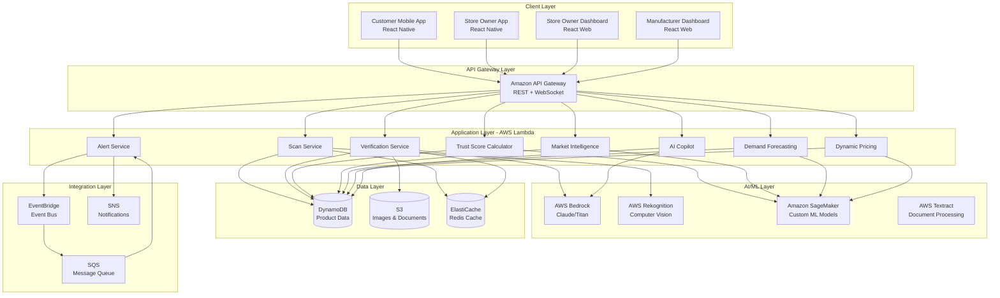

# Design Document: TrustScan AI

## Overview

TrustScan AI is a comprehensive Product Transparency & Lifecycle Intelligence Platform that addresses critical information asymmetry in retail markets through AI-powered verification, intelligent inventory management, and market intelligence. The system serves three primary user groups: end customers seeking product authenticity verification, store owners managing inventory and supplier relationships, and manufacturers tracking supply chain integrity.

### Core Value Propositions

**For Customers:**
- Instant product verification through QR scanning or visual recognition
- Trust Score combining authenticity, tampering detection, freshness analysis, and social proof
- Category-specific transparency information (electronics, FMCG, medicine, cosmetics)
- Multilingual support and voice interface for accessibility

**For Store Owners:**
- Automated stock verification to detect counterfeits before accepting delivery
- AI-powered expiry management with dynamic pricing recommendations
- Market intelligence and demand forecasting for inventory optimization
- AI Copilot providing retail operation guidance and risk analysis
- Verification Badge to build customer trust

**For Manufacturers:**
- Supply chain transparency and grey market detection
- Instant recall management with stakeholder notifications
- Regional price analysis to identify unauthorized distribution
- Product lifecycle tracking through digital twins

### Technical Approach

The platform leverages a hybrid architecture combining:
- **Mobile-first applications** (React Native) for customers and store owners
- **Serverless backend** (AWS Lambda, API Gateway) for scalability and cost efficiency
- **AI/ML services** (AWS Bedrock, Rekognition, SageMaker) for computer vision, NLP, and predictive analytics
- **NoSQL database** (DynamoDB) for high-performance product data storage
- **Real-time processing** (WebSockets, EventBridge) for alerts and notifications
- **CDN delivery** (CloudFront) for global image and content distribution


## Architecture

### System Architecture Diagram



### Architecture Principles

1. **Serverless-First**: Use AWS Lambda for compute to achieve automatic scaling and pay-per-use pricing
2. **Event-Driven**: Decouple services using EventBridge for asynchronous processing and resilience
3. **Cache-Heavy**: Leverage ElastiCache for frequently accessed product data to minimize database reads
4. **AI-Native**: Integrate AWS AI services (Bedrock, Rekognition, SageMaker) for intelligent features
5. **Mobile-Optimized**: Design APIs for low-latency, minimal payload size, and offline capability
6. **Multi-Tenant**: Support multiple manufacturers and retailers with data isolation and access control


## Components and Interfaces

### 1. QR Scanner Component

**Responsibility**: Decode QR codes and trigger visual recognition fallback

**Interface**:
```typescript
interface QRScanner {
  scanQRCode(imageData: ImageData): Promise<ScanResult>
  triggerVisualRecognition(imageData: ImageData): Promise<VisualRecognitionResult>
}

type ScanResult = {
  success: boolean
  productId?: string
  qrType: 'manufacturer' | 'retailer' | 'none'
  confidence: number
  timestamp: Date
}

type VisualRecognitionResult = {
  productId: string
  productName: string
  category: ProductCategory
  confidence: number
  matchedImages: string[]
}
```

**Implementation Details**:
- Use device camera API for QR code scanning
- Decode QR codes locally on device for speed
- If QR decode fails after 3 attempts, invoke AWS Rekognition Custom Labels for visual product identification
- Cache recently scanned products for offline access

### 2. Trust Score Calculator

**Responsibility**: Compute composite trust score from multiple signals

**Interface**:
```typescript
interface TrustScoreCalculator {
  calculateTrustScore(productId: string, context: ScanContext): Promise<TrustScore>
  getSignalWeights(category: ProductCategory): SignalWeights
}

type TrustScore = {
  overall: number // 0-100
  signals: {
    authenticity: AuthenticitySignal
    tampering: TamperingSignal
    freshness: FreshnessSignal
    socialProof: SocialProofSignal
  }
  confidence: number
  lastUpdated: Date
}

type SignalWeights = {
  authenticity: number // default 0.30
  tampering: number // default 0.30
  freshness: number // default 0.25
  socialProof: number // default 0.15
}

type AuthenticitySignal = {
  status: 'genuine' | 'suspicious' | 'unknown'
  confidence: number
  verificationMethod: string[]
  details: string
}

type TamperingSignal = {
  status: 'intact' | 'opened' | 'resealed' | 'unknown'
  confidence: number
  evidenceImages?: string[]
  details: string
}

type FreshnessSignal = {
  status: 'fresh' | 'near-expiry' | 'expired' | 'unknown'
  daysUntilExpiry?: number
  manufacturingDate?: Date
  expiryDate?: Date
  details: string
}

type SocialProofSignal = {
  rating: number // 1-5
  reviewCount: number
  verifiedPurchases: number
  sentimentScore: number // -1 to 1
}
```

**Implementation Details**:
- Calculate weighted average of four signals based on category-specific weights
- Store signal weights in DynamoDB configuration table
- Use SageMaker model for authenticity prediction when database verification unavailable
- Cache trust scores in ElastiCache with 1-hour TTL


### 3. Authenticity Verifier

**Responsibility**: Validate product genuineness through multiple verification methods

**Interface**:
```typescript
interface AuthenticityVerifier {
  verifyProduct(productId: string, serialNumber: string, batchCode: string): Promise<AuthenticityResult>
  checkManufacturerDatabase(productId: string): Promise<DatabaseVerification>
  checkBlockchain(productId: string): Promise<BlockchainVerification>
  compareVisualFeatures(productImages: string[]): Promise<VisualVerification>
}

type AuthenticityResult = {
  isAuthentic: boolean
  confidence: number
  verificationMethods: VerificationMethod[]
  flags: string[]
  recommendation: string
}

type VerificationMethod = {
  method: 'database' | 'blockchain' | 'visual' | 'serial'
  result: 'pass' | 'fail' | 'inconclusive'
  details: string
}
```

**Implementation Details**:
- Query manufacturer API endpoints for serial number validation
- Check blockchain records (if product registered on Ethereum/Polygon)
- Use AWS Rekognition to compare product images against reference images in S3
- Implement fraud pattern detection using SageMaker model trained on known counterfeits
- Flag products with duplicate serial numbers in different locations

### 4. Tampering Detector

**Responsibility**: Analyze packaging images to detect physical tampering

**Interface**:
```typescript
interface TamperingDetector {
  analyzePackaging(productImages: string[]): Promise<TamperingAnalysis>
  detectBrokenSeals(image: string): Promise<SealAnalysis>
  detectResealing(image: string): Promise<ResealingAnalysis>
}

type TamperingAnalysis = {
  tampered: boolean
  confidence: number
  indicators: TamperingIndicator[]
  evidenceRegions: BoundingBox[]
  recommendation: string
}

type TamperingIndicator = {
  type: 'broken_seal' | 'misaligned_label' | 'adhesive_residue' | 'box_deformation' | 'color_mismatch'
  confidence: number
  location: BoundingBox
  description: string
}

type BoundingBox = {
  x: number
  y: number
  width: number
  height: number
}
```

**Implementation Details**:
- Use AWS Rekognition Custom Labels trained on tampered vs intact packaging
- Detect seal integrity using edge detection and pattern matching
- Identify adhesive residue through texture analysis
- Compare packaging alignment against reference images
- Highlight suspicious regions in returned images for user review


### 5. Freshness Analyzer

**Responsibility**: Calculate product freshness based on dates and storage conditions

**Interface**:
```typescript
interface FreshnessAnalyzer {
  analyzeFreshness(product: Product, storageData?: StorageConditions): Promise<FreshnessAnalysis>
  extractDatesFromPackaging(image: string): Promise<DateExtraction>
  calculateShelfLife(category: ProductCategory, manufacturingDate: Date): number
}

type FreshnessAnalysis = {
  status: 'fresh' | 'near-expiry' | 'expired'
  daysRemaining: number
  freshnessScore: number // 0-100
  factors: FreshnessFactor[]
  recommendation: string
}

type FreshnessFactor = {
  factor: 'age' | 'storage_temp' | 'humidity' | 'light_exposure'
  impact: 'positive' | 'negative' | 'neutral'
  details: string
}

type StorageConditions = {
  temperatureLogs: TemperatureLog[]
  humidityLogs: HumidityLog[]
  lightExposure: number
}
```

**Implementation Details**:
- Use AWS Textract to extract manufacturing and expiry dates from packaging images
- Apply category-specific shelf life calculations (electronics: warranty-based, FMCG: expiry-based)
- Integrate IoT sensor data when available for storage condition analysis
- Calculate freshness score: 100 at manufacturing, linear decay to 0 at expiry
- Adjust score based on storage conditions (temperature abuse reduces score)

### 6. AI Copilot Service

**Responsibility**: Provide conversational AI assistance for retail operations

**Interface**:
```typescript
interface AICopilot {
  chat(userId: string, message: string, context: ConversationContext): Promise<CopilotResponse>
  analyzeStorePerformance(storeId: string): Promise<PerformanceInsights>
  recommendActions(storeId: string): Promise<ActionRecommendation[]>
}

type CopilotResponse = {
  message: string
  suggestions: string[]
  actions: CopilotAction[]
  confidence: number
}

type CopilotAction = {
  type: 'adjust_pricing' | 'reorder_stock' | 'contact_supplier' | 'run_promotion'
  description: string
  expectedImpact: string
  priority: 'high' | 'medium' | 'low'
}

type PerformanceInsights = {
  summary: string
  metrics: {
    wasteRate: number
    verificationPassRate: number
    customerTrustScore: number
    revenueRecovery: number
  }
  trends: Trend[]
  recommendations: string[]
}
```

**Implementation Details**:
- Use AWS Bedrock (Claude 3) for natural language understanding and generation
- Maintain conversation context in DynamoDB with session management
- Integrate with store data (inventory, sales, verification history) for contextual responses
- Provide proactive insights by analyzing patterns in store data
- Support multilingual conversations using AWS Translate


### 7. Market Intelligence Engine

**Responsibility**: Analyze market trends, competitor pricing, and demand patterns

**Interface**:
```typescript
interface MarketIntelligenceEngine {
  getMarketTrends(region: string, category: ProductCategory): Promise<MarketTrends>
  analyzeCompetitorPricing(productId: string, location: Location): Promise<PricingAnalysis>
  identifyOpportunities(storeId: string): Promise<BusinessOpportunity[]>
}

type MarketTrends = {
  trendingProducts: ProductTrend[]
  decliningCategories: CategoryTrend[]
  seasonalPatterns: SeasonalPattern[]
  emergingDemand: DemandSignal[]
}

type PricingAnalysis = {
  averagePrice: number
  priceRange: { min: number; max: number }
  competitorPrices: CompetitorPrice[]
  recommendedPrice: number
  pricePosition: 'premium' | 'competitive' | 'discount'
}

type BusinessOpportunity = {
  type: 'high_demand_low_supply' | 'underpriced_product' | 'seasonal_opportunity'
  description: string
  potentialRevenue: number
  actionRequired: string
  urgency: 'high' | 'medium' | 'low'
}
```

**Implementation Details**:
- Aggregate anonymized scan data across regions to identify trending products
- Use SageMaker time-series models to detect demand patterns
- Query competitor pricing from public sources and user-reported prices
- Calculate market position using percentile ranking
- Generate opportunity alerts using rule-based and ML-based detection

### 8. Demand Forecaster

**Responsibility**: Predict future product demand for inventory optimization

**Interface**:
```typescript
interface DemandForecaster {
  forecastDemand(productId: string, storeId: string, horizon: number): Promise<DemandForecast>
  getOptimalReorderPoint(productId: string, storeId: string): Promise<ReorderRecommendation>
  adjustForExternalFactors(forecast: DemandForecast, factors: ExternalFactor[]): DemandForecast
}

type DemandForecast = {
  predictions: DemandPrediction[]
  confidence: number
  influencingFactors: Factor[]
  accuracy: number // based on historical performance
}

type DemandPrediction = {
  date: Date
  predictedDemand: number
  confidenceInterval: { lower: number; upper: number }
}

type ReorderRecommendation = {
  reorderPoint: number
  reorderQuantity: number
  expectedStockoutDate: Date
  reasoning: string
}

type ExternalFactor = {
  type: 'festival' | 'weather' | 'local_event' | 'competitor_action'
  impact: number // -1 to 1
  confidence: number
}
```

**Implementation Details**:
- Train SageMaker DeepAR models on historical scan and sales data
- Incorporate seasonality, trends, and external events (festivals, weather)
- Use Prophet for time-series forecasting with holiday effects
- Calculate safety stock based on demand variability
- Continuously update models with actual sales data for accuracy improvement


### 9. Dynamic Pricing Service

**Responsibility**: Calculate optimal pricing based on demand, competition, and expiry

**Interface**:
```typescript
interface DynamicPricingService {
  calculateOptimalPrice(productId: string, context: PricingContext): Promise<PricingRecommendation>
  calculateExpiryDiscount(product: Product, daysRemaining: number): Promise<DiscountRecommendation>
  simulatePriceImpact(productId: string, proposedPrice: number): Promise<PriceImpactSimulation>
}

type PricingContext = {
  currentPrice: number
  costPrice: number
  competitorPrices: number[]
  inventoryLevel: number
  demandForecast: number
  daysUntilExpiry?: number
}

type PricingRecommendation = {
  recommendedPrice: number
  expectedRevenue: number
  expectedSellThroughRate: number
  reasoning: string
  priceElasticity: number
}

type DiscountRecommendation = {
  discountPercentage: number
  finalPrice: number
  expectedSellThroughProbability: number
  revenueRecovery: number
  urgency: 'critical' | 'high' | 'medium'
}
```

**Implementation Details**:
- Use SageMaker regression models to predict price elasticity
- Calculate expiry discounts using urgency-based curves (steeper near expiry)
- Consider competitor pricing, inventory levels, and demand forecasts
- Implement A/B testing framework to validate pricing recommendations
- Track actual vs predicted outcomes to improve model accuracy

### 10. Fraud Pattern Detector

**Responsibility**: Identify suspicious patterns across the product network

**Interface**:
```typescript
interface FraudPatternDetector {
  detectDuplicateSerials(serialNumber: string): Promise<DuplicationAlert>
  analyzeReviewPatterns(productId: string): Promise<ReviewFraudAnalysis>
  detectSupplyChainAnomalies(productId: string): Promise<SupplyChainAnomaly[]>
}

type DuplicationAlert = {
  isDuplicate: boolean
  scanLocations: Location[]
  scanTimes: Date[]
  suspicionLevel: 'high' | 'medium' | 'low'
  affectedUsers: string[]
}

type ReviewFraudAnalysis = {
  suspiciousReviews: Review[]
  fraudIndicators: FraudIndicator[]
  genuineReviewPercentage: number
  recommendation: 'filter' | 'flag' | 'accept'
}

type SupplyChainAnomaly = {
  type: 'skipped_tier' | 'unauthorized_region' | 'rapid_movement' | 'custody_gap'
  description: string
  severity: 'critical' | 'high' | 'medium' | 'low'
  evidence: string[]
}
```

**Implementation Details**:
- Use graph analysis to detect serial number cloning across locations
- Apply NLP sentiment analysis and pattern matching for fake review detection
- Implement anomaly detection using isolation forests on supply chain data
- Create fraud signatures from known counterfeit operations
- Generate real-time alerts for high-severity fraud patterns


### 11. Document Processor

**Responsibility**: Extract structured information from product documents

**Interface**:
```typescript
interface DocumentProcessor {
  processInvoice(documentUrl: string): Promise<InvoiceData>
  processCertificate(documentUrl: string): Promise<CertificateData>
  processLabel(imageUrl: string): Promise<LabelData>
}

type InvoiceData = {
  productDetails: ProductDetail[]
  batchNumbers: string[]
  quantities: number[]
  prices: number[]
  supplier: string
  date: Date
  confidence: number
}

type CertificateData = {
  certificationType: string
  issuingAuthority: string
  validFrom: Date
  validUntil: Date
  certificationMarks: string[]
  confidence: number
}

type LabelData = {
  ingredients: string[]
  nutritionalInfo: NutritionalInfo
  allergens: string[]
  manufacturingDate: Date
  expiryDate: Date
  regulatoryMarks: string[]
  confidence: number
}
```

**Implementation Details**:
- Use AWS Textract for OCR and document structure extraction
- Apply AWS Bedrock for intelligent information extraction and normalization
- Implement document type classification using image features
- Extract tables, key-value pairs, and free text using Textract Forms and Tables
- Validate extracted data against expected formats and ranges
- Support multilingual documents with AWS Translate integration

### 12. Supply Chain Tracker

**Responsibility**: Monitor product movement and custody transfers

**Interface**:
```typescript
interface SupplyChainTracker {
  recordCustodyTransfer(transfer: CustodyTransfer): Promise<void>
  getProductJourney(productId: string): Promise<ProductJourney>
  detectGreyMarket(productId: string): Promise<GreyMarketAnalysis>
}

type CustodyTransfer = {
  productId: string
  fromParty: string
  toParty: string
  location: Location
  timestamp: Date
  verificationStatus: 'verified' | 'unverified'
  documents: string[]
}

type ProductJourney = {
  origin: Location
  currentLocation: Location
  custodyChain: CustodyTransfer[]
  gaps: CustodyGap[]
  integrityScore: number
}

type GreyMarketAnalysis = {
  isGreyMarket: boolean
  evidence: string[]
  unauthorizedRegions: string[]
  divertedFromTier: string
  estimatedLoss: number
}
```

**Implementation Details**:
- Store custody transfers in DynamoDB with composite sort keys for efficient querying
- Create product journey visualizations using geographic data
- Detect grey market by comparing actual vs authorized distribution paths
- Flag products appearing in unauthorized regions or skipping distribution tiers
- Generate alerts for manufacturers when diversion is detected


### 13. Recall Manager

**Responsibility**: Manage product recalls and stakeholder notifications

**Interface**:
```typescript
interface RecallManager {
  issueRecall(recall: RecallNotice): Promise<RecallCampaign>
  notifyAffectedUsers(recallId: string): Promise<NotificationResult>
  trackRecallEffectiveness(recallId: string): Promise<RecallMetrics>
}

type RecallNotice = {
  productIds: string[]
  batchNumbers?: string[]
  serialNumberRange?: { start: string; end: string }
  manufacturingDateRange?: { start: Date; end: Date }
  reason: string
  severity: 'critical' | 'high' | 'medium'
  returnInstructions: string
  compensationDetails?: string
}

type RecallCampaign = {
  recallId: string
  affectedProductCount: number
  affectedUserCount: number
  notificationsSent: number
  status: 'active' | 'completed'
}

type RecallMetrics = {
  notificationReach: number
  returnRate: number
  productsRemoved: number
  productsStillInCirculation: number
  complianceScore: number
}
```

**Implementation Details**:
- Query DynamoDB to identify all affected products by batch/serial/date
- Send push notifications via SNS to all users who scanned affected products
- Alert store owners via WebSocket for immediate inventory removal
- Display prominent warnings in Customer App when recalled products are scanned
- Track return confirmations and update Product Digital Twin status
- Generate compliance reports for regulatory authorities

### 14. Voice Interface Service

**Responsibility**: Provide speech-based interaction for accessibility

**Interface**:
```typescript
interface VoiceInterfaceService {
  processVoiceCommand(audioData: AudioData, language: string): Promise<VoiceResponse>
  textToSpeech(text: string, language: string): Promise<AudioData>
  enableVoiceMode(userId: string): Promise<VoiceSession>
}

type VoiceResponse = {
  transcription: string
  intent: string
  response: string
  audioResponse: AudioData
  followUpPrompts: string[]
}

type VoiceSession = {
  sessionId: string
  language: string
  context: ConversationContext
  active: boolean
}
```

**Implementation Details**:
- Use AWS Transcribe for speech-to-text in 22 Indian languages
- Use AWS Polly for natural-sounding text-to-speech
- Integrate with AI Copilot for conversational understanding
- Maintain voice session context for multi-turn conversations
- Provide audio feedback for all UI interactions in voice mode
- Support voice commands for scanning, navigation, and information retrieval


## Data Models

### Product Digital Twin

```typescript
type ProductDigitalTwin = {
  // Primary Key
  productId: string // PK: PRODUCT#{uuid}
  
  // Product Information
  name: string
  category: ProductCategory
  brand: string
  manufacturer: string
  
  // Identification
  serialNumber?: string
  batchCode?: string
  manufacturerQR?: string
  retailerQR?: string
  
  // Dates
  manufacturingDate: Date
  expiryDate?: Date
  warrantyUntil?: Date
  
  // Authenticity
  authenticityStatus: 'verified' | 'suspicious' | 'counterfeit' | 'unknown'
  verificationMethods: string[]
  blockchainRecord?: string
  
  // Physical State
  tamperingStatus: 'intact' | 'opened' | 'resealed' | 'unknown'
  tamperingEvidence?: string[]
  
  // Supply Chain
  custodyChain: CustodyTransfer[]
  currentLocation: Location
  authorizedRegions: string[]
  
  // Metadata
  images: string[]
  documents: string[]
  certificates: string[]
  
  // Timestamps
  createdAt: Date
  updatedAt: Date
  lastScannedAt: Date
  scanCount: number
}

type ProductCategory = 
  | 'electronics'
  | 'fmcg'
  | 'medicine'
  | 'cosmetics'
  | 'apparel'
  | 'food'
  | 'beverage'
  | 'other'
```

### Scan Record

```typescript
type ScanRecord = {
  // Primary Key
  scanId: string // PK: SCAN#{uuid}
  
  // Foreign Keys
  productId: string // GSI: productId-timestamp-index
  userId: string // GSI: userId-timestamp-index
  storeId?: string
  
  // Scan Details
  scanType: 'customer' | 'store_owner' | 'manufacturer'
  scanMethod: 'qr_manufacturer' | 'qr_retailer' | 'visual_recognition'
  
  // Location
  location: Location
  
  // Results
  trustScore: TrustScore
  verificationResult: VerificationResult
  
  // Context
  deviceInfo: DeviceInfo
  appVersion: string
  
  // Timestamps
  timestamp: Date
  processingTime: number // milliseconds
}

type Location = {
  latitude: number
  longitude: number
  city: string
  state: string
  country: string
  accuracy: number
}
```

### Store Profile

```typescript
type StoreProfile = {
  // Primary Key
  storeId: string // PK: STORE#{uuid}
  
  // Store Information
  name: string
  ownerName: string
  ownerContact: string
  
  // Location
  address: string
  location: Location
  
  // Verification Status
  verificationBadge: boolean
  badgeAwardedAt?: Date
  verificationPassRate: number
  totalVerifications: number
  
  // Inventory
  inventoryCount: number
  expiringProductsCount: number
  
  // Performance Metrics
  customerTrustScore: number
  wasteReductionRate: number
  revenueRecovery: number
  
  // Suppliers
  suppliers: SupplierRelationship[]
  
  // Timestamps
  createdAt: Date
  updatedAt: Date
  lastActiveAt: Date
}

type SupplierRelationship = {
  supplierId: string
  supplierName: string
  verificationPassRate: number
  totalDeliveries: number
  lastDeliveryAt: Date
  trustScore: number
}
```


### Inventory Item

```typescript
type InventoryItem = {
  // Composite Key
  storeId: string // PK: STORE#{storeId}
  productId: string // SK: PRODUCT#{productId}
  
  // Inventory Details
  quantity: number
  costPrice: number
  sellingPrice: number
  
  // Freshness
  expiryDate?: Date
  daysUntilExpiry?: number
  freshnessStatus: 'fresh' | 'near-expiry' | 'expired'
  
  // Pricing
  discountPercentage: number
  dynamicPricingEnabled: boolean
  recommendedPrice?: number
  
  // Verification
  verificationStatus: 'verified' | 'pending' | 'failed'
  verifiedAt?: Date
  verificationDetails?: VerificationResult
  
  // Marketplace
  listedOnMarketplace: boolean
  marketplaceListingId?: string
  
  // Timestamps
  addedAt: Date
  updatedAt: Date
  lastSoldAt?: Date
}
```

### Review

```typescript
type Review = {
  // Primary Key
  reviewId: string // PK: REVIEW#{uuid}
  
  // Foreign Keys
  productId: string // GSI: productId-timestamp-index
  userId: string
  
  // Review Content
  rating: number // 1-5
  title: string
  content: string
  images?: string[]
  
  // Verification
  verifiedPurchase: boolean
  scanId?: string
  
  // Analysis
  sentimentScore: number // -1 to 1
  fraudScore: number // 0-1
  flaggedAsFraud: boolean
  
  // Engagement
  helpfulCount: number
  reportCount: number
  
  // Timestamps
  createdAt: Date
  updatedAt: Date
}
```

### Market Data

```typescript
type MarketData = {
  // Composite Key
  region: string // PK: REGION#{region}
  date: string // SK: DATE#{YYYY-MM-DD}
  
  // Aggregated Metrics
  totalScans: number
  uniqueProducts: number
  uniqueUsers: number
  
  // Category Trends
  categoryScans: Record<ProductCategory, number>
  trendingProducts: ProductTrend[]
  
  // Pricing
  averagePrices: Record<string, number> // productId -> price
  priceVariance: Record<string, number>
  
  // Authenticity
  counterfeitRate: number
  tamperingRate: number
  
  // Computed At
  computedAt: Date
}

type ProductTrend = {
  productId: string
  productName: string
  scanCount: number
  growthRate: number // percentage
  trendDirection: 'rising' | 'stable' | 'declining'
}
```

### Demand Forecast

```typescript
type DemandForecast = {
  // Composite Key
  storeId: string // PK: STORE#{storeId}
  productId: string // SK: PRODUCT#{productId}
  
  // Forecast Data
  predictions: DemandPrediction[]
  confidence: number
  accuracy: number // based on historical performance
  
  // Influencing Factors
  seasonality: number
  trend: number
  externalFactors: ExternalFactor[]
  
  // Recommendations
  reorderPoint: number
  reorderQuantity: number
  expectedStockoutDate?: Date
  
  // Model Info
  modelVersion: string
  trainedAt: Date
  
  // Timestamps
  generatedAt: Date
  validUntil: Date
}
```

### Recall Notice

```typescript
type RecallNotice = {
  // Primary Key
  recallId: string // PK: RECALL#{uuid}
  
  // Recall Details
  manufacturerId: string
  productIds: string[]
  batchNumbers?: string[]
  serialNumberRange?: { start: string; end: string }
  manufacturingDateRange?: { start: Date; end: Date }
  
  // Reason
  reason: string
  severity: 'critical' | 'high' | 'medium'
  healthRisk: string
  
  // Instructions
  returnInstructions: string
  compensationDetails?: string
  contactInfo: string
  
  // Tracking
  affectedProductCount: number
  affectedUserCount: number
  notificationsSent: number
  returnedCount: number
  
  // Status
  status: 'active' | 'completed' | 'cancelled'
  
  // Timestamps
  issuedAt: Date
  completedAt?: Date
  updatedAt: Date
}
```

### DynamoDB Table Design

**Primary Tables:**

1. **ProductTable**
   - PK: `productId`
   - GSI1: `category-lastScannedAt-index` (for trending products)
   - GSI2: `serialNumber-index` (for duplicate detection)

2. **ScanTable**
   - PK: `scanId`
   - GSI1: `productId-timestamp-index` (for product scan history)
   - GSI2: `userId-timestamp-index` (for user scan history)
   - GSI3: `location-timestamp-index` (for regional analysis)

3. **StoreTable**
   - PK: `storeId`
   - GSI1: `location-verificationPassRate-index` (for store discovery)

4. **InventoryTable**
   - PK: `storeId`, SK: `productId`
   - GSI1: `storeId-expiryDate-index` (for expiry alerts)

5. **ReviewTable**
   - PK: `reviewId`
   - GSI1: `productId-timestamp-index` (for product reviews)
   - GSI2: `userId-timestamp-index` (for user reviews)

6. **MarketDataTable**
   - PK: `region`, SK: `date`
   - GSI1: `date-region-index` (for cross-region analysis)

7. **RecallTable**
   - PK: `recallId`
   - GSI1: `status-issuedAt-index` (for active recalls)


## Correctness Properties

*A property is a characteristic or behavior that should hold true across all valid executions of a system—essentially, a formal statement about what the system should do. Properties serve as the bridge between human-readable specifications and machine-verifiable correctness guarantees.*

### Product Scanning Properties

**Property 1: QR Scan Performance**
*For any* valid QR code (manufacturer or retailer), scanning and retrieving product information should complete within the specified time limits (2 seconds for QR decode, 5 seconds for visual recognition fallback).
**Validates: Requirements 1.1, 1.3**

**Property 2: QR to Product Linkage**
*For any* retailer QR code, scanning should successfully link to the corresponding Product_Digital_Twin record with matching productId.
**Validates: Requirements 1.2**

**Property 3: Trust Score Display Completeness**
*For any* successful product scan, the displayed popup should contain all four required signals (authenticity, tampering, freshness, social proof) and the overall trust score.
**Validates: Requirements 1.4, 2.3**

**Property 4: Visual Recognition Confidence Display**
*For any* product identified through visual recognition, the results should include a confidence level value between 0 and 1.
**Validates: Requirements 1.5**

### Trust Score Calculation Properties

**Property 5: Trust Score Weighted Calculation**
*For any* set of signal values, the calculated trust score should equal the weighted sum: (authenticity × 0.30) + (tampering × 0.30) + (freshness × 0.25) + (socialProof × 0.15), normalized to 0-100 scale.
**Validates: Requirements 2.1**

**Property 6: Trust Score Color Mapping**
*For any* trust score value, the color indicator should be green for scores 80-100, yellow for 50-79, and red for 0-49.
**Validates: Requirements 2.2**

**Property 7: Low Trust Score Warning**
*For any* product with trust score below 50, the display should include a prominent warning message.
**Validates: Requirements 2.5**

**Property 8: Missing Data Indication**
*For any* trust score calculation with insufficient data for one or more signals, the system should explicitly indicate which signals are unavailable and provide a reason.
**Validates: Requirements 2.6**

### Authenticity Verification Properties

**Property 9: Verification Method Cascade**
*For any* product scan, the authenticity verification should attempt methods in order: manufacturer database → blockchain records → visual comparison, stopping at the first successful verification.
**Validates: Requirements 3.1, 3.2, 3.3**

**Property 10: Counterfeit Flagging and Notification**
*For any* product identified as counterfeit, the system should both flag the product in the database and trigger a notification to relevant authorities.
**Validates: Requirements 3.4**

**Property 11: Confidence Level Display**
*For any* completed authenticity verification, the result should include a confidence level (high/medium/low) alongside the authenticity status.
**Validates: Requirements 3.5**

**Property 12: Serial Number Duplication Detection**
*For any* serial number, if scans occur in locations more than 50km apart within a 24-hour window, the fraud detector should flag potential cloning.
**Validates: Requirements 3.6**

### Tampering Detection Properties

**Property 13: Tampering Analysis Execution**
*For any* product scan with packaging images, the tampering detector should perform analysis checking for all four indicators: broken seals, misaligned labels, adhesive residue, and box deformation.
**Validates: Requirements 4.1, 4.2**

**Property 14: Confidence-Based Tampering Display**
*For any* tampering analysis result, the display status should be: "Opened/Resealed" with evidence for confidence >80%, "Possible Tampering" with inspection recommendation for confidence 50-80%, and "Intact" for confidence <50%.
**Validates: Requirements 4.3, 4.4, 4.5**

**Property 15: Tampering Feedback Collection**
*For any* user-reported false positive or false negative on tampering detection, the system should store the feedback with the associated scan ID and product ID for model improvement.
**Validates: Requirements 4.6**

### Freshness Analysis Properties

**Property 16: Date Extraction**
*For any* product with visible manufacturing or expiry dates on packaging, the freshness analyzer should extract these dates using OCR or retrieve them from product data.
**Validates: Requirements 5.1**

**Property 17: Category-Specific Freshness Calculation**
*For any* two products in different categories with identical manufacturing dates, the freshness calculations should use category-specific factors (electronics: warranty, FMCG: shelf life, medicine: stability).
**Validates: Requirements 5.2**

**Property 18: Storage Condition Integration**
*For any* product with available storage condition data (temperature logs, humidity), the freshness score should be adjusted based on these environmental factors compared to optimal storage conditions.
**Validates: Requirements 5.3**


## Error Handling

### Error Categories and Strategies

#### 1. Scan Failures

**Scenarios:**
- QR code unreadable (damaged, poor lighting, motion blur)
- Visual recognition fails to identify product
- Network timeout during product data retrieval

**Handling Strategy:**
- Retry up to 3 times with user guidance (improve lighting, hold steady)
- After 3 failures, offer manual product entry or issue reporting
- Cache recently scanned products for offline retry
- Log failure reasons for analytics and model improvement

**Implementation:**
```typescript
async function handleScanFailure(attempt: number, error: ScanError): Promise<ScanResult> {
  if (attempt < 3) {
    return {
      success: false,
      retryable: true,
      guidance: getScanGuidance(error.type),
      nextAttempt: attempt + 1
    }
  }
  
  return {
    success: false,
    retryable: false,
    fallbackOptions: ['manual_entry', 'report_issue'],
    errorLog: logScanFailure(error)
  }
}
```

#### 2. Data Unavailability

**Scenarios:**
- Manufacturer database unreachable
- Product not registered in system
- Missing expiry date or manufacturing date
- No storage condition data available

**Handling Strategy:**
- Gracefully degrade: show available signals, mark unavailable ones as "Unknown"
- Explain why data is unavailable (e.g., "Manufacturer database offline")
- Adjust trust score calculation to use only available signals
- Suggest alternative verification methods when possible

**Implementation:**
```typescript
function calculateTrustScoreWithMissingData(signals: Partial<Signals>): TrustScore {
  const availableSignals = Object.keys(signals).filter(k => signals[k] !== undefined)
  const totalWeight = availableSignals.reduce((sum, key) => sum + WEIGHTS[key], 0)
  
  // Renormalize weights for available signals
  const normalizedWeights = {}
  availableSignals.forEach(key => {
    normalizedWeights[key] = WEIGHTS[key] / totalWeight
  })
  
  return {
    overall: calculateWeightedScore(signals, normalizedWeights),
    confidence: availableSignals.length / 4, // Reduced confidence with missing data
    missingSignals: Object.keys(WEIGHTS).filter(k => !availableSignals.includes(k)),
    explanation: generateMissingDataExplanation(signals)
  }
}
```

#### 3. AI/ML Service Failures

**Scenarios:**
- AWS Rekognition timeout or error
- AWS Bedrock rate limit exceeded
- SageMaker endpoint unavailable
- Model inference error

**Handling Strategy:**
- Implement exponential backoff retry for transient failures
- Fall back to cached results if available (with staleness indicator)
- Use simpler rule-based logic as ultimate fallback
- Alert operations team for persistent failures
- Maintain service health dashboard

**Implementation:**
```typescript
async function callAIServiceWithFallback<T>(
  primaryService: () => Promise<T>,
  fallbackService: () => Promise<T>,
  cacheKey: string
): Promise<T> {
  try {
    return await retryWithBackoff(primaryService, { maxRetries: 3, baseDelay: 1000 })
  } catch (primaryError) {
    logger.warn('Primary AI service failed', { error: primaryError, cacheKey })
    
    // Try cache
    const cached = await getFromCache(cacheKey)
    if (cached && !isTooStale(cached)) {
      return { ...cached.data, fromCache: true, cachedAt: cached.timestamp }
    }
    
    // Try fallback
    try {
      return await fallbackService()
    } catch (fallbackError) {
      logger.error('All AI services failed', { primaryError, fallbackError })
      throw new AIServiceUnavailableError('Unable to process request')
    }
  }
}
```

#### 4. Data Consistency Errors

**Scenarios:**
- Conflicting product information from multiple sources
- Serial number exists but doesn't match product details
- Custody chain gaps or inconsistencies
- Price anomalies (too high or too low)

**Handling Strategy:**
- Flag inconsistencies prominently to users
- Use confidence scoring to weight conflicting sources
- Trigger manual review for critical inconsistencies
- Log all conflicts for data quality improvement
- Provide transparency about conflicting information

**Implementation:**
```typescript
function resolveConflictingData(sources: DataSource[]): ResolvedData {
  const conflicts = detectConflicts(sources)
  
  if (conflicts.length === 0) {
    return { data: mergeData(sources), confidence: 1.0, conflicts: [] }
  }
  
  // Weight sources by reliability
  const weighted = sources.map(s => ({
    ...s,
    weight: getSourceReliability(s.type)
  }))
  
  const resolved = weightedMerge(weighted)
  
  return {
    data: resolved,
    confidence: calculateConfidence(conflicts, weighted),
    conflicts: conflicts.map(c => ({
      field: c.field,
      values: c.values,
      resolution: c.resolvedValue,
      explanation: explainResolution(c)
    }))
  }
}
```

#### 5. Rate Limiting and Quota Management

**Scenarios:**
- Too many scans from single user (potential abuse)
- AWS service quotas exceeded
- Database throttling under high load
- API rate limits reached

**Handling Strategy:**
- Implement per-user rate limiting (e.g., 100 scans/hour)
- Use exponential backoff for throttled requests
- Queue non-urgent operations (analytics, batch processing)
- Scale Lambda concurrency and DynamoDB capacity automatically
- Provide clear feedback to users about rate limits

**Implementation:**
```typescript
async function checkRateLimit(userId: string, action: string): Promise<RateLimitResult> {
  const key = `ratelimit:${userId}:${action}`
  const limit = RATE_LIMITS[action]
  
  const current = await redis.incr(key)
  if (current === 1) {
    await redis.expire(key, limit.window)
  }
  
  if (current > limit.max) {
    return {
      allowed: false,
      retryAfter: await redis.ttl(key),
      message: `Rate limit exceeded. Please try again in ${await redis.ttl(key)} seconds.`
    }
  }
  
  return {
    allowed: true,
    remaining: limit.max - current,
    resetAt: Date.now() + (await redis.ttl(key)) * 1000
  }
}
```

#### 6. Security and Privacy Errors

**Scenarios:**
- Unauthorized access attempts
- Data breach detection
- PII exposure in logs or responses
- Malicious input (SQL injection, XSS attempts)

**Handling Strategy:**
- Validate and sanitize all inputs
- Implement authentication and authorization checks
- Encrypt sensitive data at rest and in transit
- Monitor for suspicious patterns and block malicious actors
- Comply with GDPR, CCPA, and Indian data protection laws
- Incident response plan for security breaches

**Implementation:**
```typescript
function validateAndSanitizeInput(input: any, schema: Schema): ValidatedInput {
  // Input validation
  const validation = schema.validate(input)
  if (!validation.valid) {
    throw new ValidationError(validation.errors)
  }
  
  // Sanitization
  const sanitized = {
    ...input,
    // Remove potential XSS
    textFields: Object.keys(input)
      .filter(k => typeof input[k] === 'string')
      .reduce((acc, k) => ({
        ...acc,
        [k]: sanitizeHtml(input[k])
      }), {}),
    // Mask PII in logs
    _logSafe: maskPII(input)
  }
  
  return sanitized
}
```


## Testing Strategy

### Dual Testing Approach

TrustScan AI requires comprehensive testing using both unit tests and property-based tests. These approaches are complementary:

- **Unit tests** verify specific examples, edge cases, and error conditions
- **Property tests** verify universal properties across all inputs through randomization
- Together they provide comprehensive coverage: unit tests catch concrete bugs, property tests verify general correctness

### Property-Based Testing Framework

**Framework Selection:** 
- **TypeScript/JavaScript**: fast-check
- **Python** (for ML models): Hypothesis

**Configuration:**
- Minimum 100 iterations per property test (due to randomization)
- Each property test must reference its design document property
- Tag format: `Feature: trustscan-ai, Property {number}: {property_text}`

### Testing Layers

#### 1. Component Unit Tests

**QR Scanner Component:**
```typescript
describe('QR Scanner', () => {
  it('should decode valid manufacturer QR codes', () => {
    const qrData = generateManufacturerQR('PROD-12345')
    const result = qrScanner.scanQRCode(qrData)
    expect(result.success).toBe(true)
    expect(result.productId).toBe('PROD-12345')
    expect(result.qrType).toBe('manufacturer')
  })
  
  it('should handle damaged QR codes gracefully', () => {
    const damagedQR = corruptQRCode(generateManufacturerQR('PROD-12345'))
    const result = qrScanner.scanQRCode(damagedQR)
    expect(result.success).toBe(false)
    expect(result.retryable).toBe(true)
  })
  
  it('should trigger visual recognition after QR failure', async () => {
    const productImage = loadTestImage('product-no-qr.jpg')
    const result = await qrScanner.triggerVisualRecognition(productImage)
    expect(result.confidence).toBeGreaterThan(0)
    expect(result.productId).toBeDefined()
  })
})
```

**Trust Score Calculator:**
```typescript
describe('Trust Score Calculator', () => {
  it('should calculate weighted average correctly', () => {
    const signals = {
      authenticity: 90,
      tampering: 80,
      freshness: 70,
      socialProof: 60
    }
    const score = calculator.calculateTrustScore('PROD-123', signals)
    // 90*0.3 + 80*0.3 + 70*0.25 + 60*0.15 = 27 + 24 + 17.5 + 9 = 77.5
    expect(score.overall).toBe(77.5)
  })
  
  it('should handle missing signals gracefully', () => {
    const signals = {
      authenticity: 90,
      tampering: 80
      // freshness and socialProof missing
    }
    const score = calculator.calculateTrustScore('PROD-123', signals)
    expect(score.confidence).toBeLessThan(1.0)
    expect(score.missingSignals).toContain('freshness')
    expect(score.missingSignals).toContain('socialProof')
  })
})
```

#### 2. Property-Based Tests

**Property 1: QR Scan Performance**
```typescript
import fc from 'fast-check'

// Feature: trustscan-ai, Property 1: QR Scan Performance
describe('Property: QR Scan Performance', () => {
  it('should decode any valid QR code within 2 seconds', async () => {
    await fc.assert(
      fc.asyncProperty(
        fc.string({ minLength: 10, maxLength: 100 }), // Random product IDs
        async (productId) => {
          const qrCode = generateManufacturerQR(productId)
          const startTime = Date.now()
          const result = await qrScanner.scanQRCode(qrCode)
          const duration = Date.now() - startTime
          
          expect(result.success).toBe(true)
          expect(duration).toBeLessThan(2000)
          expect(result.productId).toBe(productId)
        }
      ),
      { numRuns: 100 }
    )
  })
})
```

**Property 5: Trust Score Weighted Calculation**
```typescript
// Feature: trustscan-ai, Property 5: Trust Score Weighted Calculation
describe('Property: Trust Score Weighted Calculation', () => {
  it('should calculate weighted sum correctly for any signal values', () => {
    fc.assert(
      fc.property(
        fc.integer({ min: 0, max: 100 }), // authenticity
        fc.integer({ min: 0, max: 100 }), // tampering
        fc.integer({ min: 0, max: 100 }), // freshness
        fc.integer({ min: 0, max: 100 }), // socialProof
        (auth, tamp, fresh, social) => {
          const expected = auth * 0.30 + tamp * 0.30 + fresh * 0.25 + social * 0.15
          const result = calculator.calculateTrustScore('PROD-TEST', {
            authenticity: auth,
            tampering: tamp,
            freshness: fresh,
            socialProof: social
          })
          
          expect(result.overall).toBeCloseTo(expected, 2)
        }
      ),
      { numRuns: 100 }
    )
  })
})
```

**Property 6: Trust Score Color Mapping**
```typescript
// Feature: trustscan-ai, Property 6: Trust Score Color Mapping
describe('Property: Trust Score Color Mapping', () => {
  it('should map any trust score to correct color', () => {
    fc.assert(
      fc.property(
        fc.integer({ min: 0, max: 100 }),
        (score) => {
          const color = getColorForScore(score)
          
          if (score >= 80) {
            expect(color).toBe('green')
          } else if (score >= 50) {
            expect(color).toBe('yellow')
          } else {
            expect(color).toBe('red')
          }
        }
      ),
      { numRuns: 100 }
    )
  })
})
```

**Property 12: Serial Number Duplication Detection**
```typescript
// Feature: trustscan-ai, Property 12: Serial Number Duplication Detection
describe('Property: Serial Number Duplication Detection', () => {
  it('should flag any serial scanned in distant locations within 24 hours', async () => {
    await fc.assert(
      fc.asyncProperty(
        fc.string({ minLength: 8, maxLength: 20 }), // serial number
        fc.tuple(fc.double({ min: -90, max: 90 }), fc.double({ min: -180, max: 180 })), // location 1
        fc.tuple(fc.double({ min: -90, max: 90 }), fc.double({ min: -180, max: 180 })), // location 2
        async (serial, loc1, loc2) => {
          const distance = calculateDistance(loc1, loc2)
          
          // Only test if locations are >50km apart
          fc.pre(distance > 50)
          
          // Simulate scans
          await recordScan(serial, loc1, Date.now())
          await recordScan(serial, loc2, Date.now() + 1000) // 1 second later
          
          const alert = await fraudDetector.detectDuplicateSerials(serial)
          
          expect(alert.isDuplicate).toBe(true)
          expect(alert.suspicionLevel).toBeOneOf(['high', 'medium'])
        }
      ),
      { numRuns: 100 }
    )
  })
})
```

#### 3. Integration Tests

**End-to-End Scan Flow:**
```typescript
describe('Integration: Complete Scan Flow', () => {
  it('should complete full scan workflow from QR to trust score display', async () => {
    // Setup
    const product = await createTestProduct({
      category: 'electronics',
      hasManufacturerQR: true,
      isAuthentic: true,
      isTampered: false
    })
    
    // Execute
    const qrCode = product.manufacturerQR
    const scanResult = await scanService.scan(qrCode, testUser.id)
    
    // Verify
    expect(scanResult.success).toBe(true)
    expect(scanResult.trustScore).toBeDefined()
    expect(scanResult.trustScore.overall).toBeGreaterThan(70)
    expect(scanResult.trustScore.signals.authenticity.status).toBe('genuine')
    expect(scanResult.trustScore.signals.tampering.status).toBe('intact')
    
    // Verify database records
    const scanRecord = await db.getScanRecord(scanResult.scanId)
    expect(scanRecord.productId).toBe(product.productId)
    expect(scanRecord.userId).toBe(testUser.id)
  })
  
  it('should handle counterfeit detection and notification', async () => {
    const counterfeitProduct = await createTestProduct({
      isAuthentic: false,
      serialNumber: 'FAKE-12345'
    })
    
    const scanResult = await scanService.scan(counterfeitProduct.qr, testUser.id)
    
    expect(scanResult.trustScore.signals.authenticity.status).toBe('suspicious')
    expect(scanResult.trustScore.overall).toBeLessThan(50)
    
    // Verify notification sent
    const notifications = await getNotifications('authorities')
    expect(notifications).toContainEqual(
      expect.objectContaining({
        type: 'counterfeit_detected',
        productId: counterfeitProduct.productId
      })
    )
  })
})
```

**Store Owner Verification Flow:**
```typescript
describe('Integration: Store Owner Stock Verification', () => {
  it('should verify batch of products and generate report', async () => {
    const products = await createTestProducts(10, { isAuthentic: true })
    const store = await createTestStore()
    
    const verificationResult = await storeService.verifyBatch(
      store.storeId,
      products.map(p => p.productId)
    )
    
    expect(verificationResult.totalItems).toBe(10)
    expect(verificationResult.passedItems).toBe(10)
    expect(verificationResult.failedItems).toBe(0)
    expect(verificationResult.report).toBeDefined()
    
    // Verify custody transfer recorded
    for (const product of products) {
      const journey = await supplyChainTracker.getProductJourney(product.productId)
      expect(journey.custodyChain).toContainEqual(
        expect.objectContaining({
          toParty: store.storeId,
          verificationStatus: 'verified'
        })
      )
    }
  })
})
```

#### 4. ML Model Tests

**Tampering Detection Model:**
```python
import hypothesis as hp
from hypothesis import given, strategies as st

# Feature: trustscan-ai, Property 13: Tampering Analysis Execution
@given(st.binary(min_size=1000, max_size=100000))  # Random image data
def test_tampering_detector_always_returns_result(image_data):
    """For any image input, tampering detector should return a valid result"""
    result = tampering_detector.analyze(image_data)
    
    assert result is not None
    assert 'tampered' in result
    assert 'confidence' in result
    assert 0 <= result['confidence'] <= 1
    assert 'indicators' in result
    assert isinstance(result['indicators'], list)
```

**Demand Forecasting Model:**
```python
@given(
    st.lists(st.floats(min_value=0, max_value=1000), min_size=30, max_size=365),  # Historical demand
    st.integers(min_value=1, max_value=90)  # Forecast horizon
)
def test_demand_forecast_properties(historical_demand, horizon):
    """For any historical demand data, forecast should have valid properties"""
    forecast = demand_forecaster.forecast(historical_demand, horizon)
    
    # Forecast length matches horizon
    assert len(forecast.predictions) == horizon
    
    # All predictions are non-negative
    assert all(p.predicted_demand >= 0 for p in forecast.predictions)
    
    # Confidence intervals are valid
    for pred in forecast.predictions:
        assert pred.confidence_interval.lower <= pred.predicted_demand
        assert pred.predicted_demand <= pred.confidence_interval.upper
```

#### 5. Performance Tests

**Load Testing:**
```typescript
describe('Performance: Concurrent Scans', () => {
  it('should handle 10,000 concurrent scans within 5 seconds', async () => {
    const products = await createTestProducts(100)
    const users = await createTestUsers(1000)
    
    const scanPromises = []
    for (let i = 0; i < 10000; i++) {
      const product = products[i % products.length]
      const user = users[i % users.length]
      scanPromises.push(scanService.scan(product.qr, user.id))
    }
    
    const startTime = Date.now()
    const results = await Promise.all(scanPromises)
    const duration = Date.now() - startTime
    
    expect(duration).toBeLessThan(5000)
    expect(results.filter(r => r.success).length).toBeGreaterThan(9500) // 95% success rate
  })
})
```

### Test Coverage Goals

- **Unit Test Coverage**: >80% code coverage
- **Property Test Coverage**: All 18 correctness properties implemented
- **Integration Test Coverage**: All critical user flows (scan, verify, alert, marketplace)
- **Performance Test Coverage**: All performance-critical paths (scan, trust score calculation, AI inference)
- **Security Test Coverage**: All authentication, authorization, and input validation paths

### Continuous Testing

- Run unit tests on every commit
- Run property tests on every pull request
- Run integration tests nightly
- Run performance tests weekly
- Run security scans daily
- Monitor production errors and create regression tests

